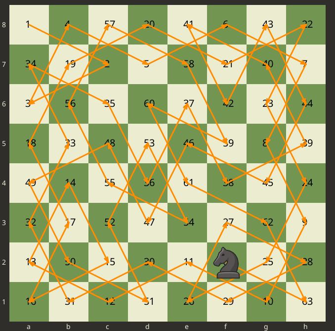

# Knight Tour
This project is a visualization of Knight's Tour problem in chess using Warnsdorff algorithm.

## Todo
- [X] Size of board is determined as N * N.
- [X] Initial position of knight is get through (x, y) coordinates.
- [ ] When pressed cancel, exit the full application. It shouldn't go to next stage.
- [ ] Search for closed tour (where knight returns to the starting point)
- [ ] Remove repetition of same path for same starting point